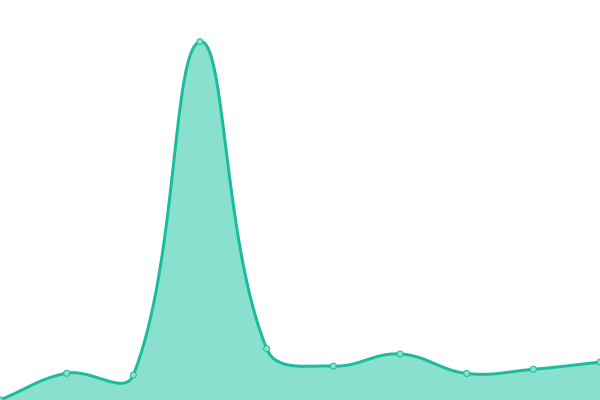

# [📈 Live Status](https://valicek1.github.io/upptime): <!--live status--> **🟩 All systems operational**

This repository contains the open-source uptime monitor and status page for [Vaclav Valicek](http://valicek.name), powered by [Upptime](https://github.com/upptime/upptime).

With [Upptime](https://upptime.js.org), you can get your own unlimited and free uptime monitor and status page, powered entirely by a GitHub repository. We use [Issues](https://github.com/valicek1/upptime/issues) as incident reports, [Actions](https://github.com/valicek1/upptime/actions) as uptime monitors, and [Pages](https://valicek1.github.io/upptime) for the status page.

<!--start: status pages-->
<!-- This summary is generated by Upptime (https://github.com/upptime/upptime) -->
<!-- Do not edit this manually, your changes will be overwritten -->
<!-- prettier-ignore -->
| URL | Status | History | Response Time | Uptime |
| --- | ------ | ------- | ------------- | ------ |
|  [[SERV] Uptime Kuma](https://kuma.sw3.cz) | 🟩 Up | [serv-uptime-kuma.yml](https://github.com/Valicek1/upptime/commits/HEAD/history/serv-uptime-kuma.yml) | 

 998ms
     
 | 

<a href="https://valicek1.github.io/upptime/history/serv-uptime-kuma">99.38%</a>
    

|  [[SERV] munin](https://munin.ycnet.cz) | 🟩 Up | [serv-munin.yml](https://github.com/Valicek1/upptime/commits/HEAD/history/serv-munin.yml) | 

 1056ms
     
 | 

<a href="https://valicek1.github.io/upptime/history/serv-munin">100.00%</a>
    

|  [[SERV] mrtg](https://mrtg.ycnet.cz) | 🟩 Up | [serv-mrtg.yml](https://github.com/Valicek1/upptime/commits/HEAD/history/serv-mrtg.yml) | 

 813ms
     
 | 

<a href="https://valicek1.github.io/upptime/history/serv-mrtg">100.00%</a>
    

|  [[SERV] smokeping](https://smokeping.ycnet.cz) | 🟩 Up | [serv-smokeping.yml](https://github.com/Valicek1/upptime/commits/HEAD/history/serv-smokeping.yml) | 

 888ms
     
 | 

<a href="https://valicek1.github.io/upptime/history/serv-smokeping">98.29%</a>
    

|  [[SW3] Flákač](https://flakac.sw3.cz) | 🟩 Up | [sw-3-flakac.yml](https://github.com/Valicek1/upptime/commits/HEAD/history/sw-3-flakac.yml) | 

 2410ms
     
 | 

<a href="https://valicek1.github.io/upptime/history/sw-3-flakac">100.00%</a>
    

|  [[SW3] Gambler](https://gambler.sw3.cz) | 🟩 Up | [sw-3-gambler.yml](https://github.com/Valicek1/upptime/commits/HEAD/history/sw-3-gambler.yml) | 

 660ms
     
 | 

<a href="https://valicek1.github.io/upptime/history/sw-3-gambler">100.00%</a>
    

|  [[SW3] Hppro](https://hppro.sw3.cz) | 🟩 Up | [sw-3-hppro.yml](https://github.com/Valicek1/upptime/commits/HEAD/history/sw-3-hppro.yml) | 

 657ms
     
 | 

<a href="https://valicek1.github.io/upptime/history/sw-3-hppro">100.00%</a>
    

|  [[SW3] INS](https://ins.sw3.cz) | 🟩 Up | [sw-3-ins.yml](https://github.com/Valicek1/upptime/commits/HEAD/history/sw-3-ins.yml) | 

 715ms
     
 | 

<a href="https://valicek1.github.io/upptime/history/sw-3-ins">100.00%</a>
    

|  [[SW3] Ispconfig](https://config.sw3.cz) | 🟩 Up | [sw-3-ispconfig.yml](https://github.com/Valicek1/upptime/commits/HEAD/history/sw-3-ispconfig.yml) | 

 866ms
     
 | 

<a href="https://valicek1.github.io/upptime/history/sw-3-ispconfig">14.49%</a>
    

|  [[SW3] Kripl](https://kripl.sw3.cz/test.html) | 🟩 Up | [sw-3-kripl.yml](https://github.com/Valicek1/upptime/commits/HEAD/history/sw-3-kripl.yml) | 

 831ms
     
 | 

<a href="https://valicek1.github.io/upptime/history/sw-3-kripl">100.00%</a>
    

|  [[SW3] Lemra](https://lemra.sw3.cz) | 🟩 Up | [sw-3-lemra.yml](https://github.com/Valicek1/upptime/commits/HEAD/history/sw-3-lemra.yml) | 

 936ms
     
 | 

<a href="https://valicek1.github.io/upptime/history/sw-3-lemra">99.39%</a>
    

|  [[SW3] LemraDNS](https://lemradns.sw3.cz) | 🟩 Up | [sw-3-lemra-dns.yml](https://github.com/Valicek1/upptime/commits/HEAD/history/sw-3-lemra-dns.yml) | 

 816ms
     
 | 

<a href="https://valicek1.github.io/upptime/history/sw-3-lemra-dns">99.40%</a>
    

|  [[SW3] 맔칤rák](https://smirak.sw3.cz) | 🟩 Up | [sw-3-smirak.yml](https://github.com/Valicek1/upptime/commits/HEAD/history/sw-3-smirak.yml) | 

 928ms
     
 | 

<a href="https://valicek1.github.io/upptime/history/sw-3-smirak">100.00%</a>
    

|  [[SW3] Trpaslík](trpaslik.sw3.cz) | 🟩 Up | [sw-3-trpaslik.yml](https://github.com/Valicek1/upptime/commits/HEAD/history/sw-3-trpaslik.yml) | 

 136ms
     
 | 

<a href="https://valicek1.github.io/upptime/history/sw-3-trpaslik">100.00%</a>
    

|  [[SW3] Zmetak](https://zmetek.sw3.cz) | 🟩 Up | [sw-3-zmetak.yml](https://github.com/Valicek1/upptime/commits/HEAD/history/sw-3-zmetak.yml) | 

 842ms
     
 | 

<a href="https://valicek1.github.io/upptime/history/sw-3-zmetak">100.00%</a>
    

|  [[SW3] Nextcloud](https://cloud.sw3.cz) | 🟩 Up | [sw-3-nextcloud.yml](https://github.com/Valicek1/upptime/commits/HEAD/history/sw-3-nextcloud.yml) | 

 1138ms
     
 | 

<a href="https://valicek1.github.io/upptime/history/sw-3-nextcloud">100.00%</a>
    

|  [[SW3] HASS](https://ha.sw3.cz) | 🟩 Up | [sw-3-hass.yml](https://github.com/Valicek1/upptime/commits/HEAD/history/sw-3-hass.yml) | 

 619ms
     
 | 

<a href="https://valicek1.github.io/upptime/history/sw-3-hass">100.00%</a>
    

|  [[SW3] ha-ovalenta](https://ovalenta.sw3.cz) | 🟩 Up | [sw-3-ha-ovalenta.yml](https://github.com/Valicek1/upptime/commits/HEAD/history/sw-3-ha-ovalenta.yml) | 

 746ms
     
 | 

<a href="https://valicek1.github.io/upptime/history/sw-3-ha-ovalenta">100.00%</a>
    

|  [[YC] Blekota](blekota.ycnet.cz) | 🟩 Up | [yc-blekota.yml](https://github.com/Valicek1/upptime/commits/HEAD/history/yc-blekota.yml) | 

 164ms
     
 | 

<a href="https://valicek1.github.io/upptime/history/yc-blekota">100.00%</a>
    

|  [[YC] Nemehlo](nemehlo.ycnet.cz) | 🟩 Up | [yc-nemehlo.yml](https://github.com/Valicek1/upptime/commits/HEAD/history/yc-nemehlo.yml) | 

 134ms
     
 | 

<a href="https://valicek1.github.io/upptime/history/yc-nemehlo">100.00%</a>
    

<!--end: status pages-->

[**Visit our status website →**](https://valicek1.github.io/upptime)

## 📄 License

- Powered by: [Upptime](https://github.com/upptime/upptime)
- Code: [MIT](./LICENSE) © [Anand Chowdhary](https://anandchowdhary.com), supported by [Pabio](https://pabio.com)
- Data in the `./history` directory: [Open Database License](https://opendatacommons.org/licenses/odbl/1-0/)
